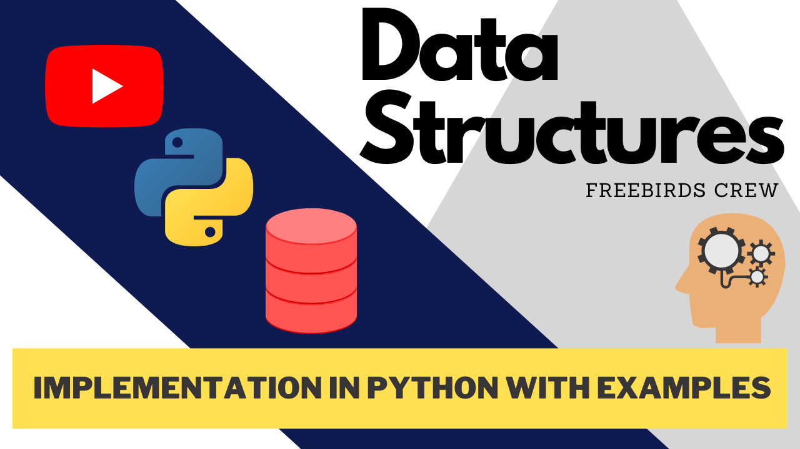

# DataStructures_Python
### Data Structures Implementation in Python and Explains each Steps.

## 🔴 Data Structures and Algorithms using Python 🔴

### YouTube Link - https://bit.ly/2RrlM0M

Welcome to our Competetive Programming Playlist that includes the Data Structures, Algorithms, and Coding Questions that mostly asked in Interviews of Google, Facebook, Microsoft, and Amazon Implemented in Python with Proper Explanation and Logics to Increase the Logic Building and Problem Solving Technique.

Here Now available the Arrays Data Structures in the Repository -

🔴Arrays Include - 
1. Introduction to Data Structures and Arrays
2. Static Array Implementation in Python
3. Dynamic Array Implementation in Python
4. Array - Build-in Library in Python
5. Coding Questions that Mostly asked in Interviews

🔵Playlists that make you skilled up - 

Data Science and Analysis - https://bit.ly/3hnTY8M

Machine Learning - https://bit.ly/3gsuIxb

Face Recognition - https://bit.ly/2YphpHm

Creative Python - https://bit.ly/34nM9wr

Latest Tech Videos - https://bit.ly/2QcaOeW

🔴Next this Week - Stacks Implementation in Python with Examples.

This Repository Will Keep You Update about all the Data Strucutres in Python -
1. Arrays
2. Stacks
3. LinkedLists
4. Queue
5. Trees
6. Heap
7. Hashing
8. Graphs
9. Advance Data Structures
10. Matrix and Strings

### Connect with us:

